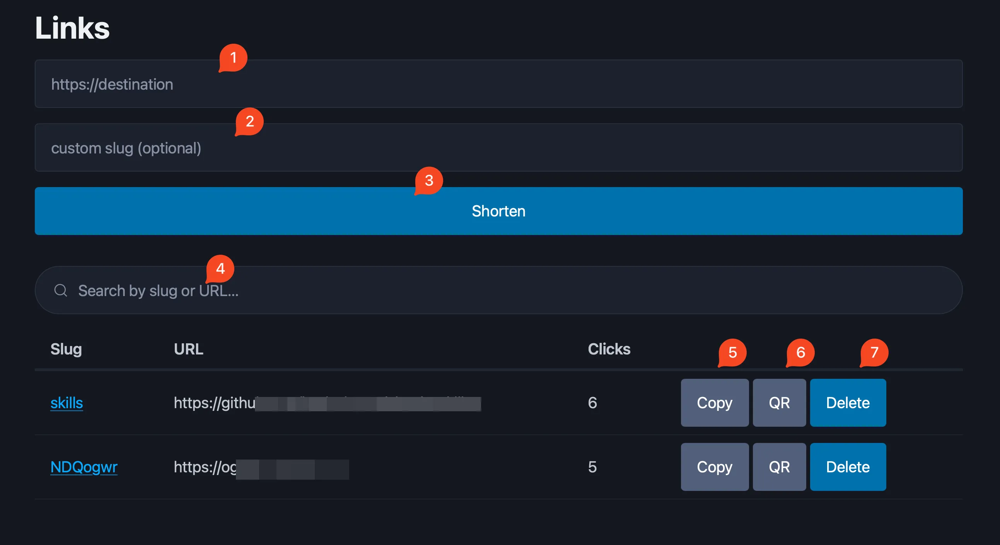

# Stem

**an edge URL shortener**

A single-user URL shortener that runs on Cloudflare Workers (Hono + D1), with a
Chrome-compatible browser extension. MIT licensed.

**No secrets live in this repo.** Every credential, including your short-link
hostname, is set at deploy time through Wrangler Secrets or the Cloudflare
dashboard.

## What it does
- Redirects with 302, so disabling or expiring a link takes effect right away, and counts clicks without storing IPs or per-visitor logs
- Exposes a REST API at `/api/links`. The worker verifies either a scoped Bearer token or a Cloudflare Access JWT; put Access in front of `/api` and clients (browser dashboard, extension via an Access service token) authenticate through it
- Checks every destination before saving it: scheme allowlist, normalization, private/internal-host (SSRF) blocking, a self-reference block, and a pluggable reputation lookup (Google Safe Browsing by default)
- Supports links that expire on a date or self-destruct after N clicks
- Ships an admin dashboard at `/admin`
- Generates a QR code for any short link — in the dashboard (a `GET /api/links/:slug/qr` SVG endpoint) and in the extension popup (rendered client-side)

## Admin dashboard
The dashboard at `/admin` (behind Cloudflare Access) lists your links and creates new ones:



1. Paste a destination URL
2. Optional custom slug
3. Shorten it
4. Search by slug or destination
5. Hide inactive links (expired / disabled / used up)
6. Delete all inactive links in one go
7. Copy the short link
8. Show its QR code
9. Delete the link

Links that have expired, been disabled, or used up their one-time click stay in the
database. Expiry is a soft check: the redirect returns `410 Gone`, but the row isn't
deleted. The dashboard flags these with a status badge and a muted, struck-through
row, and adds a **Hide inactive** toggle plus a **Delete inactive** button to clear
them in bulk. The per-row **Delete** still removes a single link.

## Layout
- `shared/`: framework-free validation (Zod schemas, slug rules, URL safety), used by both the worker and the extension
- `worker/`: the Cloudflare Worker (Hono routes, D1 access, auth, and the safety pipeline)
- `extension/`: cross-browser (Chrome + Firefox) MV3 extension — see [extension/README.md](./extension/README.md)

The repo folder and npm packages are named `url-shortener` / `@url-shortener/*`;
"Stem" is the product name. The mismatch is intentional, so don't rename them.

## Prerequisites
- **Node 20** and npm. CI builds and tests on Node 20. You don't need a global
  Wrangler install: every `wrangler` command here runs through `npx`.
- A **Cloudflare account** to deploy (Worker + D1 database + Cloudflare Access).
- Authenticate Wrangler once before any remote command, from `worker/`:
  `npx wrangler login`.
- **Placeholder convention:** replace `your-domain.com`, `l.example.com`,
  `your-team.cloudflareaccess.com`, and anything in `<angle-brackets>` with your
  own values.

## Develop
```bash
npm install
cp worker/.dev.vars.example worker/.dev.vars   # fill in API_TOKEN, SHORT_DOMAIN, etc.
npm --workspace worker run migrate:local       # create + migrate the local D1 database
npm --workspace worker run dev                 # serve the worker at http://localhost:8787
npm test                                       # vitest across all workspaces
npm run typecheck                              # tsc --noEmit across all workspaces
```

## Deploy

> **Run every `wrangler` command from the `worker/` directory.** `wrangler.toml`
> lives there (not at the repo root), and `wrangler secret put` / `wrangler d1 …`
> read it to know *which* Worker to target. Run them from the repo root and you'll
> get errors like `Missing entry-point` or `No config file found` — this is the
> single most common setup snag. (The `npm run` shortcuts noted below work from the
> repo root because npm cd's into `worker/` for you.)

```bash
cd worker          # all wrangler commands below are run from here

# 1. Create the D1 database, then paste the printed `database_id` into wrangler.toml
npx wrangler d1 create url_shortener

# 2. Apply migrations to the remote database
npx wrangler d1 migrations apply url_shortener --remote   # = npm --workspace worker run migrate:remote

# 3. Set secrets (never committed).
#    API_TOKEN is NOT a Cloudflare token — it's a random secret you invent. The
#    worker only checks that an incoming `Authorization: Bearer <x>` matches it.
#    Generate one and paste it when prompted:
#        openssl rand -base64 32
npx wrangler secret put API_TOKEN
npx wrangler secret put SHORT_DOMAIN          # your short-link host, e.g. l.example.com
npx wrangler secret put SAFE_BROWSING_API_KEY # optional reputation provider

# 4. Add your short-link domain as a Workers route / custom domain in the
#    Cloudflare dashboard, then deploy
npx wrangler deploy                           # = npm run deploy (from the repo root)
```

To confirm a secret landed, list them (also from `worker/`): `npx wrangler secret list`.

## Authentication — two separate paths

It's easy to get stuck here because there are **two different credentials**, and
only one of them comes from Cloudflare:

| Credential | Who creates it | Used by | What it is |
| --- | --- | --- | --- |
| **`API_TOKEN`** (Bearer) | **You** — a random string you invent | scripts / `curl` hitting `/api` directly | a Worker secret; the worker compares `Authorization: Bearer <x>` against it |
| **Access service token** (Client ID + Secret) | **Cloudflare** Zero Trust | the browser extension | Cloudflare issues it; the worker verifies the resulting Access JWT |

So `API_TOKEN` is **not** a Cloudflare token — generate it yourself (step 3 above).
The Cloudflare-issued credential is the *Access service token*, set up below.

## Lock down /admin and /api with Cloudflare Access

Cloudflare reorganizes its dashboard from time to time; as of this writing the
menus live under **Zero Trust → Access controls**. The flow:

1. **Get your team domain.** Cloudflare dashboard → **Zero Trust → Settings →
   Team name and domain**. It looks like `your-team.cloudflareaccess.com`. This is
   the worker secret **`ACCESS_TEAM_DOMAIN`**.

2. **Create the Access application.** **Zero Trust → Access controls →
   Applications → Add an application → Self-hosted**. Add two paths on your short
   domain so both the dashboard and the API are protected:
   - `your-domain.com/admin*`
   - `your-domain.com/api/*`

3. **Grab the AUD tag.** Open that application → **Configure → Additional
   settings → Application Audience (AUD) Tag**, and copy it. This is the worker
   secret **`ACCESS_AUD`**.

4. **Add a policy so *you* can reach `/admin` in a browser.** On the application,
   add a policy with **Action = Allow**, **Include → Emails →** your own email
   (or another identity rule). This is the interactive login for the dashboard.

5. **Add a second policy for the extension's service token.** First create the
   token: **Zero Trust → Access controls → Service credentials → Service Tokens →
   Create Service Token** — copy the **Client ID** (ends in `.access`) and
   **Client Secret** (shown once). Then on the same application add another
   policy with **Action = `Service Auth`** (⚠️ *not* `Allow` — an `Allow` policy
   with a service token still expects an interactive login and is rejected with
   `service_token_status:false`), **Include → Service Token →** your token. Full
   extension walkthrough: [extension/README.md](./extension/README.md).

6. **Tell the worker to verify the JWT too** (defense in depth — so the worker
   rejects requests even if they somehow bypass the Access edge). As in Deploy,
   run these from the `worker/` directory:

   ```bash
   cd worker
   npx wrangler secret put ACCESS_TEAM_DOMAIN   # your-team.cloudflareaccess.com (step 1)
   npx wrangler secret put ACCESS_AUD           # the AUD tag from step 3
   npx wrangler deploy
   ```

To sanity-check the service token from the command line (want `200`):

```bash
curl -sS -o /dev/null -w "%{http_code}\n" \
  -H "CF-Access-Client-Id: <id>.access" -H "CF-Access-Client-Secret: <secret>" \
  https://your-domain.com/api/links
```

These steps track Cloudflare's official docs (the dashboard paths above are
quoted from them). For the canonical source — including the AUD-tag lookup and
the exact JWT-validation logic the worker mirrors — see
[Validating JSON Web Tokens](https://developers.cloudflare.com/cloudflare-one/access-controls/applications/http-apps/authorization-cookie/validating-json/),
[Service tokens](https://developers.cloudflare.com/cloudflare-one/access-controls/service-credentials/service-tokens/),
and [Team name (glossary)](https://developers.cloudflare.com/cloudflare-one/glossary/).
Cloudflare brands the product **Cloudflare One**, but the dashboard's left-nav
section is still labelled **Zero Trust** — they're the same place.

## Notes
- Link search uses `LIKE '%term%'` (a full table scan) on purpose — at single-user
  scale the table is small and the scan is sub-millisecond. If it ever grows large,
  switch to an FTS5 `trigram` virtual table kept in sync with triggers (mind the
  3-character minimum and D1's no-export-for-virtual-tables caveat).

## License
MIT. See [LICENSE](./LICENSE).
