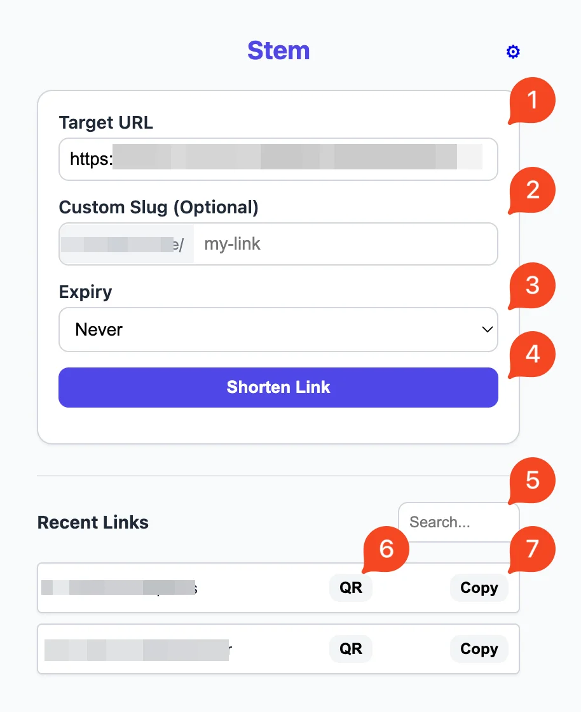
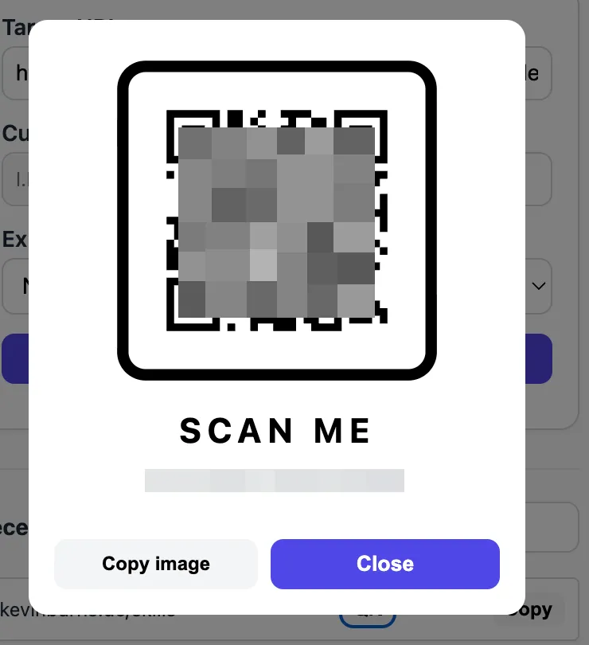
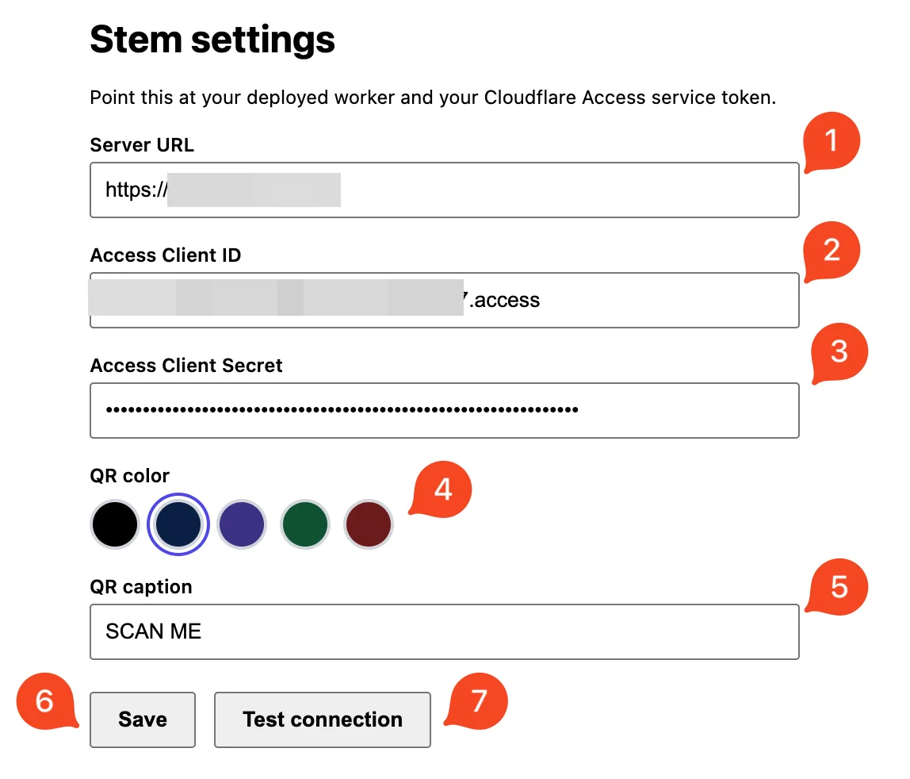

# Stem — Browser Extension

A Chrome extension that shortens the current tab against your
own deployed worker, authenticating through Cloudflare Access with a **service token**
(since `/api` is behind Access, a plain bearer token can't pass the edge). Part of the
[url-shortener](../README.md) monorepo; reuses validation from `../shared`.

**Features:** shorten the active tab (copies to clipboard) · optional custom slug,
expiry (1h/24h/7d) and one-time links · recent-links list with search and per-row
copy · QR code for any recent link (pick a color + caption in Options) · tracking/affiliate params stripped
automatically · Options page with a
**Test connection** check and least-privilege host permission.



1. Target URL (auto-filled from the current tab)
2. Optional custom slug
3. Expiry / one-time use
4. Shorten the current tab
5. Search your recent links
6. Show a recent link's QR code
7. Copy a recent link

The **⚙ gear** at the top-right opens settings.

Tapping **QR** opens a scannable "scan me" card you can copy as an image:



> **Before you start:** deploy the worker and put Cloudflare Access in front of it
> (see the [main README](../README.md)). Throughout this guide, replace
> `l.example.com`, `your-short-domain`, and anything in `<angle-brackets>` with
> your own values.

## 1. Create the Access service token

1. Zero Trust → **Access controls → Service credentials → Service Tokens → Create
   Service Token**. Name it (e.g. `url-shorten-extension`) and **copy the Client ID
   and Client Secret** — the secret is shown only once. The Client ID ends in
   `.access`.
2. Open the Access **application** that protects your short domain (the one covering
   `/admin*` and `/api/*`) → **Policies → Add a policy**:
   - **Action must be `Service Auth`**, *not* `Allow`. An `Allow` policy with a
     service token still expects an interactive login and will be rejected with
     `service_token_status:false`. (Cloudflare's UI warns about this.)
   - **Include → Service Token →** your token.

## 2. Get it — download or build

**Download (no build):** on the
[latest release](https://github.com/kevin-burns/stem/releases/latest), download the
`stem-chrome-extension-v<version>.zip` asset and unzip it.

**Or build from source.** Needs **Node 20** and npm. From the **repo root**:

```bash
npm install            # installs all workspaces (first time only)
npm run build:ext      # outputs extension/dist/chrome and extension/dist/firefox
```

**Load it (Chrome/Brave/Edge/Vivaldi/Arc):** `chrome://extensions` → enable
**Developer mode** → **Load unpacked** → select the unzipped folder (or
`extension/dist/chrome` if you built it). After a rebuild, click the card's ↻.

<!-- - **Firefox:** use **`about:debugging#/runtime/this-firefox` → Load Temporary Add-on**
  → pick `extension/dist/firefox/manifest.json` (or run `npm run pack:ext` and pick
  `dist/firefox.zip`). To reload after a rebuild, click **Reload** on the add-on.
  - Use `about:debugging`, **not** about:addons → "Install Add-on From File" — the
    latter only accepts **Mozilla-signed** packages and will fail with "could not be
    installed because it has not been verified."
  - Temporary add-ons are removed on restart. For a persistent unsigned install use
    Firefox Developer Edition/Nightly/ESR with `xpinstall.signatures.required=false`;
    for distribution, sign via addons.mozilla.org.
  - Requires **Firefox 127+** (for `optional_host_permissions`). After Save, approve
    the permission doorhanger; if the popup can't reach the server, enable host access
    under `about:addons` → the extension → Permissions. -->

## 3. Configure

Open the extension → **⚙** (or right-click the icon → Options) and enter, each value
pasted verbatim (no header names, no trimming):

- **Server URL:** your short domain, e.g. `https://l.example.com` (the redirect
  host, not the apex).
- **Access Client ID:** the full value including the `.access` suffix.
- **Access Client Secret:** the full secret.



1. Server URL — your short domain
2. Access Client ID (ends in `.access`)
3. Access Client Secret
4. QR color (scannable dark presets)
5. QR caption (default "SCAN ME")
6. **Save**
7. **Test connection** — confirms the token, policy, and host permission

Click **Save**, then **approve the host-permission prompt**. If it didn't prompt,
enable it manually: `chrome://extensions` → the extension → **Details → Site access**
→ turn on the toggle next to your domain. Use **Test connection** to confirm — a
green ✓ means the token, policy, and permission are all good.

## Troubleshooting

- **"Failed to fetch"** → the host permission isn't granted for your domain (enable
  the Site access toggle), or the Server URL points at the wrong host.
- **"Access rejected — login redirect"** → the Access policy isn't `Service Auth`,
  or the token isn't on the app covering `/api/*`. Verify with:

  ```bash
  curl -sS -o /dev/null -w "%{http_code}\n" \
    -H "CF-Access-Client-Id: <id>.access" -H "CF-Access-Client-Secret: <secret>" \
    https://your-short-domain/api/links   # want 200
  ```
